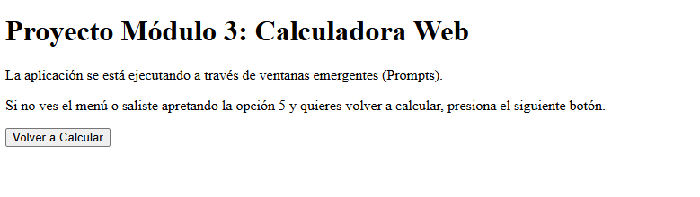
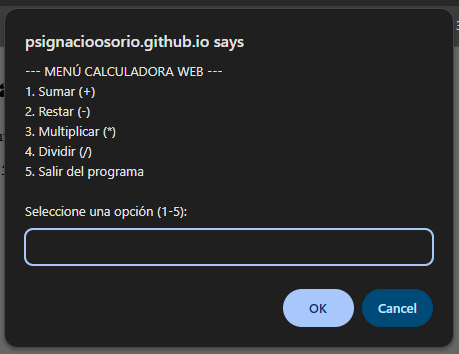
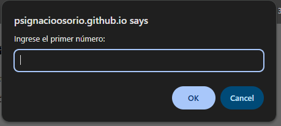
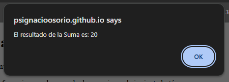
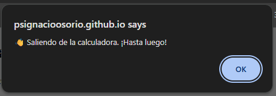
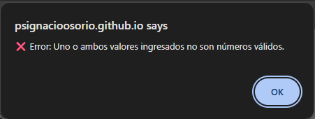

# Calculadora Web ABP3

## 📋 Descripción de la Aplicación

**Calculadora Web** es una aplicación web interactiva desarrollada en **JavaScript** que permite realizar operaciones matemáticas básicas de forma rápida y sencilla. La aplicación utiliza un menú interactivo implementado a través de ventanas emergentes (prompts) para guiar al usuario a través de las diferentes operaciones disponibles.

Esta es una aplicación educativa desarrollada como parte del **Proyecto ABP 3 del Módulo 3 de Fundamentos de Programación en JavaScript**, donde se aplican conceptos fundamentales como funciones, validación de datos, control de flujo y manejo de objetos.

---

## 🎯 Funcionalidades

La calculadora ofrece las siguientes operaciones matemáticas:

| Operación | Símbolo | Descripción |
|-----------|---------|-------------|
| **Suma** | `+` | Suma dos números ingresados por el usuario |
| **Resta** | `-` | Resta el segundo número del primero |
| **Multiplicación** | `*` | Multiplica dos números |
| **División** | `/` | Divide el primer número por el segundo (con validación de división por cero) |

### Características Principales:

- ✅ **Menú interactivo**: Sistema de menú que permite seleccionar la operación deseada
- ✅ **Validación de datos**: Controla que los valores ingresados sean números válidos
- ✅ **Manejo de errores**: Valida la división por cero y muestra mensajes de error apropiados
- ✅ **Interfaz intuitiva**: Utiliza prompts y alerts para una interacción clara con el usuario
- ✅ **Historial en consola**: Muestra las operaciones disponibles en la consola del navegador
- ✅ **Bucle continuo**: Permite realizar múltiples operaciones sin recargar la página
- ✅ **Botón de reinicio**: Opción para volver a iniciar la calculadora desde el HTML

---

## 🚀 ¿Para qué sirve?

Esta aplicación educativa tiene como propósito:

1. **Aprendizaje de JavaScript**: Enseña conceptos fundamentales como funciones, control de flujo (switch, while), validación y manejo de eventos
2. **Práctica de lógica de programación**: Permite entender cómo se estructuran operaciones matemáticas en código
3. **Demostración de interactividad web**: Muestra cómo crear aplicaciones interactivas utilizando prompts y alerts
4. **Manipulación del DOM**: Incluye botones y eventos en HTML para controlar la ejecución de la aplicación

---

## 📂 Estructura del Proyecto

```
calculadora-web-abp3/
├── index.html                 # Página principal con interfaz HTML
├── assets/
│   ├── img/                   # Carpeta para almacenar imágenes y evidencias
│   └── js/
│       └── calculadora.js     # Lógica de la calculadora en JavaScript
├── .git/                      # Repositorio Git
└── README.md                  # Este archivo
```

---

## 🎮 Cómo Usar

1. Abre el archivo `index.html` en tu navegador
2. Se abrirá automáticamente un menú interactivo donde podrás seleccionar la operación
3. Ingresa los dos números cuando se te solicite
4. Visualiza el resultado en una ventana de alerta
5. Selecciona nuevamente una operación o presiona "5" para salir
6. Si necesitas volver a calcular, presiona el botón "Volver a Calcular"

**Nota**: La aplicación se ejecuta a través de ventanas emergentes (prompts). Si cerraste el menú accidentalmente, presiona el botón en la página para reiniciar.

---

## 💻 Tecnologías Utilizadas

- **HTML5**: Estructura de la página web
- **JavaScript (Vanilla)**: Lógica de la aplicación

---

## 📸 Evidencias y Capturas de Pantalla

### Interfaz Principal


### Menú de Operaciones


### Resultado de Operación




### Validación de Errores


---

## 👨‍💻 Autor

Proyecto desarrollado como parte del Módulo 3 de Fundamentos de Programación en JavaScript

**Desarrollador**: Ps. Ignacio Osorio

---

## 📝 Notas Importantes

- La aplicación utiliza `parseFloat()` para convertir los valores ingresados a números
- Valida automáticamente la división por cero
- Los datos ingresados se validan con `isNaN()` para asegurar que sean números válidos
- El historial de operaciones se muestra en la consola del navegador

---

## 🔗 Link del Deploy

[[https://psignacioosorio.github.io/calculadora-web-abp3]] 

    https://psignacioosorio.github.io/calculadora-web-abp3/
